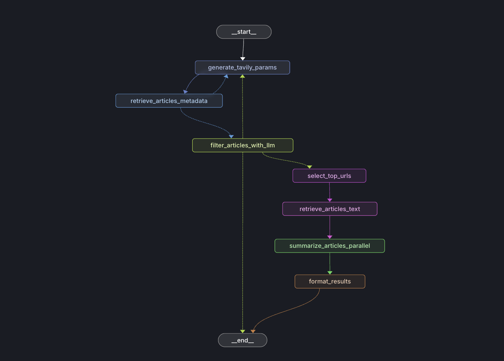

# AgenticNews: AI Research Paper & News Agent

## Overview

AgenticNews is an AI-powered application designed to autonomously discover, retrieve, and summarize the latest news, research papers, and technical advancements in the field of AI, LLMs, agent frameworks, and related technologies. The system leverages multi-agent orchestration, advanced search, and LLM summarization to deliver concise, actionable insights for engineers and researchers.

## Key Features

- **Automated News & Research Discovery:** Finds and filters the latest articles, blog posts, and research papers relevant to AI, LLMs, agent frameworks, and more.
- **Parallel Summarization:** Uses LLMs to generate bullet-point TLDRs for each article in parallel, ensuring fast and consistent summaries.
- **Multi-Agent Orchestration:** Employs a workflow engine to coordinate scraping, search, summarization, and filtering.
- **Customizable Search Parameters:** Supports advanced search queries, time ranges, and topic targeting.
- **Extensible Architecture:** Modular design allows for easy integration of new models, sources, and workflows.

## System Architecture

- **Orchestration Layer:**  
  Located in [`orchestration/`](orchestration/), this layer manages the workflow, including node execution, state management, and parallelization.  
  - Example: [`summarize_articles_parallel`](orchestration/nodes/summarize_articles.py) summarizes articles using LLMs in parallel.

- **Models:**  
  Defined in [`models/`](models/), including state management and content rating logic.

- **Services:**  
  Located in [`services/`](services/), these modules handle LLM invocation ([`llm.py`](services/llm.py)), web scraping ([`scraping.py`](services/scraping.py)), and integration with external APIs (e.g., Tavily).

- **Utils:**  
  Utility functions for text processing, formatting, and other helper tasks.

- **Configuration:**  
  - [`config.py`](config.py): Central configuration for API keys, model selection, and workflow parameters.
  - `.env`: Environment variables for sensitive credentials.

## Technologies Used

- **Python 3.11+**
- **Asyncio:** For parallel and non-blocking operations.
- **LLMs:** Used for summarization and content analysis ([`llm_g15`](services/llm.py)).
- **Web Scraping:** Automated retrieval of article content.
- **Workflow Orchestration:** Custom logic for multi-step, multi-agent pipelines.
- **External APIs:** Integration with search and retrieval services (e.g., Tavily).
- **Logging:** For observability and debugging.

## How It Works

1. **Query Generation:**  
   The system generates targeted search queries based on user or system prompts, focusing on recent and relevant AI topics.

2. **Article Retrieval:**  
   Articles are fetched using scraping services and external APIs.

3. **Filtering & Rating:**  
   Articles are filtered and rated for relevance and quality.

4. **Summarization:**  
   Each article is summarized in parallel using an LLM, producing concise, bullet-point TLDRs.

5. **Output:**  
   Summarized articles are stored in the application state and can be further processed or displayed.

## Project Structure

```
.
├── config.py
├── main.py
├── requirements.txt
├── models/
│   ├── state.py
│   ├── rated_content.py
│   └── ...
├── orchestration/
│   ├── workflow.py
│   └── nodes/
│       ├── summarize_articles.py
│       └── ...
├── services/
│   ├── llm.py
│   ├── scraping.py
│   └── tavily_service.py
├── utils/
│   └── ...
└── .langgraph_api/
    └── (checkpoint and state files)
```

## Getting Started

1. **Install dependencies:**
   ```sh
   pip install -r requirements.txt
   ```

2. **Configure environment:**
   - Set up `.env` with required API keys and configuration.

3. **Run the application:**
   ```sh
   python main.py
   ```

## Extending the System

- Add new scraping or search services in [`services/`](services/).
- Modify or add workflow nodes in [`orchestration/nodes/`](orchestration/nodes/).
- Update summarization or filtering logic as needed.

## LLM Models Used

- **Gemini 2.0 Flash** (`llm` in `services/llm.py`): Used for content analysis and article filtering, with a higher temperature for more creative outputs.
- **Gemini 1.5 Flash** (`llm_g15` in `services/llm.py`): Used for parallel summarization of articles, optimized for concise and accurate TLDRs.

## Agent Roles and Workflow

The system is built as a multi-agent pipeline, where each agent (node) is responsible for a specific task in the workflow. The main agents and their roles are:



1. **Query Generation Agent** (`generate_tavily_params`):
   - Analyzes the user/system prompt and generates targeted search queries using technical synonyms, brand names, and emerging AI terminology.
   - Focuses on recent developments in LLMs, agent frameworks, and AI tools.

2. **Article Retrieval Agent** (`retrieve_articles_metadata`):
   - Uses the generated queries to fetch article metadata from external APIs (e.g., Tavily) and scraping services.

3. **Filtering & Rating Agent** (`filter_articles_with_llm`):
   - Invokes the Gemini 2.0 Flash LLM to rate and filter articles based on relevance, technical depth, and novelty.
   - Uses a custom prompt and a JSON output parser to assign scores (0-10) to each article.
   - Selects top articles for further processing.

4. **Top URL Selection Agent** (`select_top_urls`):
   - Chooses the highest-rated articles (by score) for text retrieval and summarization.

5. **Article Text Retrieval Agent** (`retrieve_articles_text`):
   - Scrapes or fetches the full text of the selected articles.

6. **Summarization Agent** (`summarize_articles_parallel`):
   - Uses Gemini 1.5 Flash LLM to generate parallel, bullet-point TLDRs for each article.
   - Summarization is performed concurrently for efficiency.

7. **Formatting Agent** (`format_results`):
   - Formats the summarized results for output, notification, or further use.

## Workflow and Conditional Logic

The workflow is orchestrated using a graph-based engine (`orchestration/workflow.py`). Key transitions and conditions include:

- **Initial Step:** Start at `generate_tavily_params`.
- **After Article Retrieval:**
  - If no articles are found and searches remain, loop back to `generate_tavily_params` to broaden the search.
  - If articles are found, proceed to filtering.
- **After Filtering:**
  - If enough high-quality articles are found, proceed to summarization.
  - If not enough articles and searches remain, loop back to query generation.
  - If no articles and no searches remain, end the workflow with a message.
- **Parallel Summarization:**
  - Summarization is performed in parallel for all selected articles.

This agentic, conditional workflow ensures robust discovery, filtering, and summarization of the most relevant AI news and research articles.

## Telegram Bot Integration

AgenticNews includes a Telegram bot integration for automated distribution of summarized TLDRs. After the workflow completes, the application sends the formatted summaries directly to a configured Telegram chat or channel. This is handled by the `send_telegram_message` function in `services/telegram_notification.py`.

- **How it works:**
  - After summarization and formatting, the main application asynchronously sends each TLDR result to the Telegram bot.
  - The bot uses the Telegram Bot API and requires a bot token and chat ID, which are configured via environment variables in `.env`.
  - This enables real-time delivery of AI news and research summaries to individuals or groups.

- **Customization:**
  - You can modify the notification logic or extend it to support additional messaging platforms by editing or adding to the `services/telegram_notification.py` module.

---

*For more details, see the source code and comments in each module.*